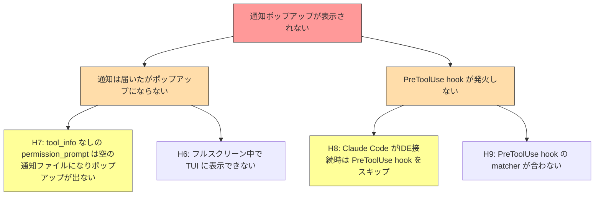

# SSH Notify デバッグ

**問題**: ssh_notify E2E テストで、リモート Claude Code の `Write` ツール使用時に lazyclaude の通知ポップアップが表示されない。

## 判明した事実

- Notification hook (permission_prompt) はリモートで発火している
- HTTP POST はサーバーに到達し 200 を返している
- PreToolUse hook はリモートで発火していない (remote-hook.log に PRETOOLUSE 行なし)
- サーバーログに `type= pid=446 window=lc-3a3d9e72 tool=` — tool 名が空
- tool_info が先に来ていないため resolveToolInfo でツール名を解決できない
- lazyclaude の通知ポップアップは表示されていない (フレーム確認済み)
- Claude Code 自身の UI に `Write(/tmp/hello.txt)` 許可ダイアログが表示されている

## 仮説マップ

## 仮説リスト

### ~~H0: hook が発火したが HTTP POST が失敗~~ → 棄却
実験1で確認: Notification hook は発火し POST 200 成功。

---

### ~~H1: IDE接続モードで Notification hook がスキップ~~ → 棄却
Notification hook は発火している。

---

### ~~H2: Sleep 30s が足りない~~ → 棄却
通知はサーバーに到達済み。

---

### ~~H3: 認証ヘッダーで 401 拒否~~ → 棄却
POST response: 200。

---

### ~~H4: Claude Code が自前UI で処理し Notification hook を発火しない~~ → 棄却
Notification hook は発火している。

---

### ~~H5: lock file 読み取り失敗~~ → 棄却
locks=["45979.lock"] で正常に読み取り。

---

### H6: MCP に届いたがフルスクリーン中で TUI に表示できない
gocui Suspend 中は MainLoop 停止。ただし lazyclaude tmux の display-popup で表示する経路がある。要検証。

---

### H7: tool_info なしの permission_prompt ではポップアップが出ない (有力)
サーバーの `resolveToolInfo` は先行する tool_info のキャッシュからツール名を取得する。tool_info が無い場合、空のツール名で通知ファイルが作成されるか、通知自体がスキップされる可能性。

---

### H8: Claude Code が IDE 接続時は PreToolUse hook をスキップ (有力)
remote-hook.log に PRETOOLUSE 行が0件。`CLAUDE_CODE_AUTO_CONNECT_IDE=true` の影響で PreToolUse hook が発火しない可能性。

---

### H9: PreToolUse hook の matcher が合わない
settings.json の PreToolUse matcher が `"*"` だが、Claude Code のバージョンによってはマッチしない可能性。

---

## 実験ログ

### 実験 1: hook にログ出力追加 (H0 検証)
0692ba1: claude-settings.json に /tmp/lazyclaude-hook.log 出力追加、entrypoint.sh でリモート hook ログ回収

**結果**:
- remote-hook.log: Notification hook 発火確認、POST 200 成功
- remote-hook.log: PreToolUse hook 発火なし (PRETOOLUSE 行 0件)
- server.log: `type= pid=446 window=lc-3a3d9e72 tool=` (tool名空)
- H0, H1, H2, H3, H4, H5 棄却。H7, H8 が有力。

---

## Issues

(なし)
